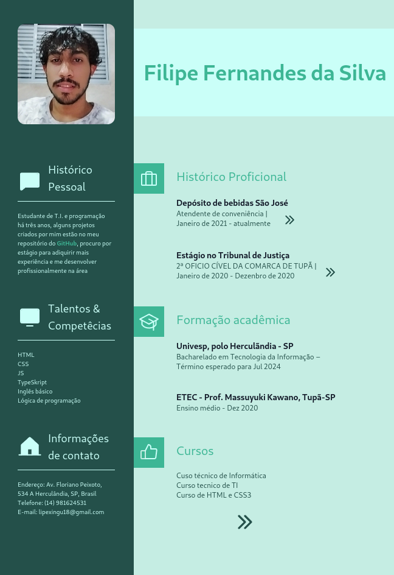

# Meu Curriculo

  Projeto criado para apresentar minhas habilidades como desenvolvedor web

[Clique aqui para acessar](https://curriculo-9z622mg80-filipe010803.vercel.app/)

## Tecnologias

Esse pojeto foi desenvolvido com as seguintes tecnologias:

- CSS
- Js
- TypeScript
- Git e Github

## Layout

Voce pode visualizar o layout do projeto através [DESSE LINK](https://www.figma.com/file/NydLNwboOiZcv9LMgVFsCx/Untitled?t=zfHyI7DKlvvFUnmd-6). É necessário ter uma conta no [Figma](https://figma.com) para acessá-lo.

## Contato

lipexingu18@gmail.com
